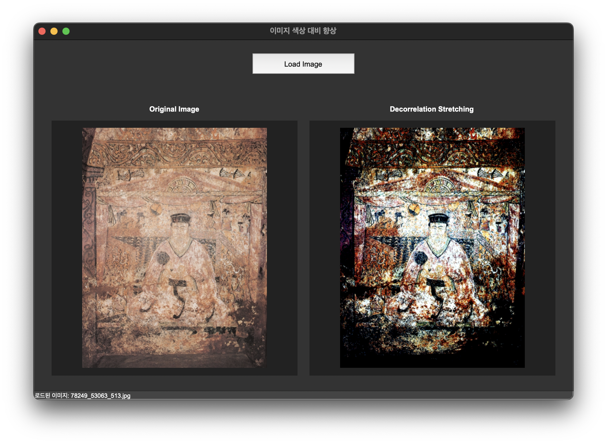
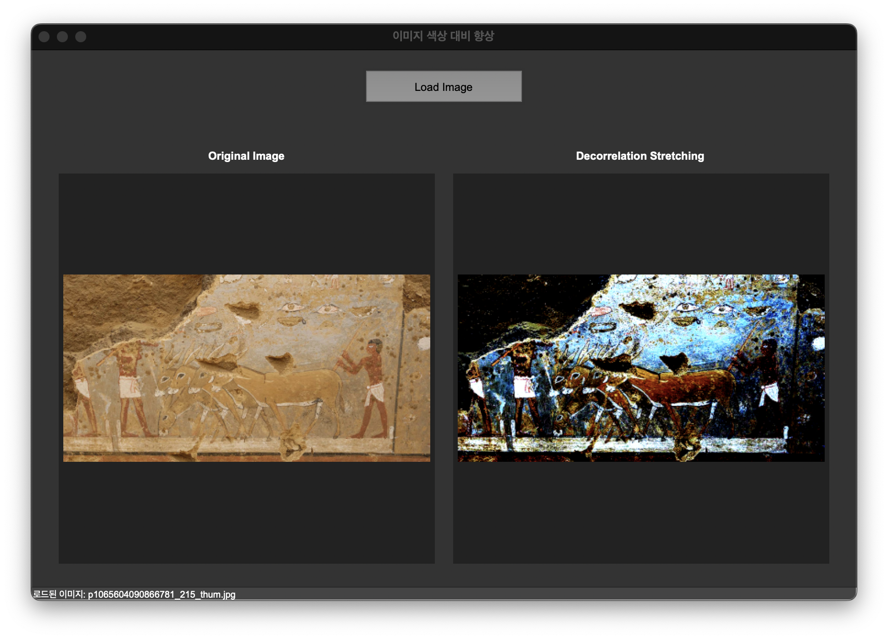

# Decorrelation Stretch

이미지의 색상 대비를 향상시키는 Decorrelation Stretching(장식 스트레칭) 알고리즘의 Python 구현입니다.

## 결과 예시





## 개요

Decorrelation Stretching은 원격 감지, 천문학, 의료 영상 등 다양한 분야에서 사용되는 이미지 향상 기술입니다. 이 알고리즘은 색상 채널 간의 상관관계를 제거하고 대비를 강화하여 이미지의 세부 정보를 더 잘 볼 수 있게 합니다.

## 주요 기능

- 이미지 로드 및 표시
- Decorrelation Stretching 알고리즘을 사용한 이미지 대비 향상
- 원본 이미지와 향상된 이미지 비교 시각화
- 사용자 친화적인 GUI 인터페이스

## 알고리즘 설명

이 구현에서 사용된 Decorrelation Stretching 알고리즘의 주요 단계:

1. 각 색상 채널(RGB)을 분리
2. 각 채널의 평균값을 계산하고 빼서 데이터 중심화
3. 채널별 표준편차 계산
4. 최대 표준편차를 기준으로 각 채널을 스케일링
5. 처리된 채널을 다시 병합

이 과정을 통해 채널 간 상관관계가 줄어들고 대비가 향상됩니다.

## 설치 요구사항

- Python 3.6+
- OpenCV (cv2)
- NumPy
- tkinter
- Pillow (PIL)

```bash
pip install opencv-python numpy pillow
```

## 사용 방법

1. 스크립트 실행:
```bash
python decorrelation_stretch.py
```

2. "Load Image" 버튼을 클릭하여 이미지 파일 선택

3. 원본 이미지와 대비가 향상된 이미지를 비교

## 응용 분야

- 원격 감지 이미지 분석
- 천문학 이미지 처리
- 의료 영상 향상
- 문서 이미지 복원
- 위성 사진 분석

## 라이센스

MIT 라이센스

## 참고자료

- [Decorrelation Stretching - Wikipedia](https://en.wikipedia.org/wiki/Decorrelation_stretching)
- [Remote Sensing Digital Image Analysis](https://www.springer.com/gp/book/9783642300615)
